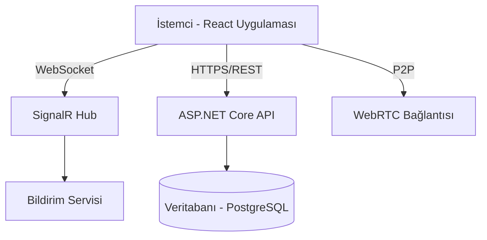

# Chatter

<div align="center">

**Kurumsal düzeyde gerçek zamanlı mesajlaşma ve görüntülü arama platformu**

[](https://reactjs.org/)
[](https://dotnet.microsoft.com/)
[](https://dotnet.microsoft.com/apps/aspnet/signalr)
[](https://webrtc.org/)
[](https://capacitorjs.com/)

[Özellikler](#temel-özellikler) • [Demo](#demo) • [Teknolojiler](#teknoloji-yığını) • [Başlangıç](#başlangıç) • [Mimari](#mimari) • [Lisans](#lisans)

</div>

---

## Genel Bakış

Chatter, modern web teknolojilerini native mobil yeteneklerle sorunsuz bir şekilde birleştiren **üretime hazır, çapraz platform iletişim platformudur**. Performans, ölçeklenebilirlik ve kullanıcı deneyimi göz önünde bulundurularak geliştirilmiştir:

- **Gerçek zamanlı mesajlaşma** - SignalR WebSocket ile 100ms altı gecikme
- **Eşler arası görüntülü/sesli aramalar** - WebRTC ile (sıfır sunucu maliyeti)
- **Native mobil uygulamalar** - Tek kod tabanından Capacitor ile
- **Kurumsal güvenlik** - JWT kimlik doğrulama ve şifreli bağlantılar
- **Modern arayüz** - Uyarlanabilir karanlık/aydınlık temalar

---

## Temel Özellikler

### Gerçek Zamanlı İletişim
- **Anlık Mesajlaşma** - SignalR ile WebSocket tabanlı, otomatik yeniden bağlanma
- **Yazıyor Göstergesi** - Kullanıcılar mesaj yazarken canlı geri bildirim
- **Okundu Bilgisi** - Teslim edilen ve okunan mesajlar için çift onay işareti
- **Çevrimiçi Durum** - Gerçek zamanlı kullanıcı durumu göstergeleri
- **Mesaj Tepkileri** - Emoji ile duyguları ifade etme
- **Yanıtla ve Alıntıla** - Bağlam farkındalığı olan mesaj zincirleme

### WebRTC Sesli ve Görüntülü Arama
- **P2P Mimari** - Doğrudan eşler arası bağlantı (medya sunucusu gerektirmez)
- **HD Video Kalitesi** - Optimum kalite için uyarlanabilir bit hızı
- **Arama Yönetimi** - Gelen arama bildirimleri, kabul/reddetme arayüzü
- **Ağ Dayanıklılığı** - Bağlantı koptuğunda otomatik yeniden bağlanma
- **Ses Kontrolleri** - Sessiz/sesli, hoparlör/kulaklık değiştirme

### Native Mobil Deneyim
- **Android APK** - Tam özellikli native Android uygulaması
- **iOS Desteği** - iOS dağıtımı için hazır (Capacitor tabanlı)
- **Push Bildirimleri** - Arka planda mesaj bildirimleri
- **Dokunsal Geri Bildirim** - Kullanıcı eylemleri için titreşim
- **Otomatik Güncelleme Sistemi** - GitHub Releases API üzerinden OTA güncellemeler
- **Çevrimdışı Mod** - Çevrimdışı senaryolar için mesaj kuyruğu

### Modern Arayüz
- **Duyarlı Tasarım** - Mobil, tablet ve masaüstü için optimize
- **Karanlık/Aydınlık Temalar** - Sistem farkındalığı ile manuel geçiş
- **Akıcı Animasyonlar** - 60 FPS GPU hızlandırmalı geçişler
- **Erişilebilirlik** - WCAG AAA uyumlu, ekran okuyucu desteği
- **Dokunma Optimizasyonu** - Kaydırma hareketleri, uzun basma menüleri
- **Ses Efektleri** - Özelleştirilebilir sesli geri bildirim

### Güvenlik ve Gizlilik
- **JWT Kimlik Doğrulama** - Yenileme token'ları ile güvenli token tabanlı kimlik doğrulama
- **Uçtan Uca Şifreleme** - (Planlanıyor) Mesajlar için E2EE
- **Sadece HTTPS** - Şifreli veri iletimi
- **CORS Koruması** - Yapılandırılmış kaynak doğrulama
- **Girdi Temizleme** - XSS ve enjeksiyon koruması

---

## Teknoloji Yığını

### Frontend
| Teknoloji | Versiyon | Amaç |
|-----------|---------|------|
| [React](https://reactjs.org/) | 18.3+ | Kullanıcı Arayüzü Framework'ü |
| [Vite](https://vitejs.dev/) | 5.0+ | Build Aracı & Geliştirme Sunucusu |
| [Tailwind CSS](https://tailwindcss.com/) | 3.4+ | Utility-first CSS Framework |
| [Axios](https://axios-http.com/) | 1.6+ | HTTP İstemcisi |
| [Zustand](https://zustand-demo.pmnd.rs/) | 4.5+ | Durum Yönetimi *(Opsiyonel)* |

### Backend
| Teknoloji | Versiyon | Amaç |
|-----------|---------|------|
| [.NET](https://dotnet.microsoft.com/) | 8.0 | Backend Framework |
| [SignalR](https://dotnet.microsoft.com/apps/aspnet/signalr) | 8.0 | Gerçek Zamanlı İletişim |
| [Entity Framework Core](https://docs.microsoft.com/ef/core/) | 8.0 | ORM |
| [PostgreSQL](https://www.postgresql.org/) / [SQL Server](https://www.microsoft.com/sql-server) | - | Veritabanı |
| [JWT Bearer](https://jwt.io/) | - | Kimlik Doğrulama |

### Gerçek Zamanlı & Medya
| Teknoloji | Amaç |
|-----------|------|
| [SignalR](https://dotnet.microsoft.com/apps/aspnet/signalr) | WebSocket tabanlı gerçek zamanlı mesajlaşma |
| [WebRTC](https://webrtc.org/) | Eşler arası video/ses akışı |
| [Simple-Peer](https://github.com/feross/simple-peer) | Daha kolay implementasyon için WebRTC sarmalayıcı |

### Mobil & Native
| Teknoloji | Amaç |
|-----------|------|
| [Capacitor](https://capacitorjs.com/) | Web'den native'e köprü |
| [Capacitor Eklentileri](https://capacitorjs.com/docs/plugins) | Native API'ler (Kamera, Bildirimler, vb.) |
| [Android Studio](https://developer.android.com/studio) | Android build ortamı |

### DevOps & Araçlar
| Araç | Amaç |
|------|------|

| [Nginx](https://nginx.org/) | Reverse Proxy & Statik Hosting |

---

## Başlangıç

### Ön Gereksinimler

Aşağıdakilerin yüklü olduğundan emin olun:

- **Node.js** 18+ ([İndir](https://nodejs.org/))
- **npm** veya **yarn** paket yöneticisi
- **.NET SDK** 8.0+ ([İndir](https://dotnet.microsoft.com/download))
- **Android Studio** (mobil build'ler için) ([İndir](https://developer.android.com/studio))
- **PostgreSQL** veya **SQL Server** (backend veritabanı için)

### Kurulum

**1. Depoyu Klonlayın**
```bash
git clone https://github.com/kullaniciadi/chatter.git
cd chatter
```

**2. Frontend Kurulumu**
```bash
cd frontend
npm install

# Ortam değişkenlerini yapılandırın
cp .env.example .env
# .env dosyasını API URL ve yapılandırma ile düzenleyin
```

**3. Backend Kurulumu**
```bash
cd backend
dotnet restore

# Veritabanı bağlantısını yapılandırın
# appsettings.json dosyasını veritabanı bağlantı dizesi ile düzenleyin

# Migration'ları çalıştırın
dotnet ef database update

# Backend sunucusunu başlatın
dotnet run
```

**4. Geliştirme Sunucusunu Çalıştırın**
```bash
# Frontend dizininde
npm run dev

# Uygulama http://localhost:5173 adresinde erişilebilir olacak
```

### Üretime Yönelik Build

#### Web Dağıtımı
```bash
npm run build
# Çıktı: dist/ klasörü dağıtıma hazır
```

#### Android APK
```bash
# Web varlıklarını build edin
npm run build

# Capacitor ile senkronize edin
npx cap sync android

# Android Studio'da açın
npx cap open android

# Android Studio'da APK build edin:
# Build → Build Bundle(s) / APK(s) → Build APK(s)
```

#### iOS Build
```bash
npm run build
npx cap sync ios
npx cap open ios
# Xcode'da build edin
```

---

## Mimari

### Sistem Mimarisi



### Uygulama Akışı

#### Kimlik Doğrulama Akışı
```
1. Kullanıcı Girişi → JWT Token Oluşturulur
2. Token LocalStorage'da Saklanır
3. Token Header ile WebSocket Bağlantısı
4. Kullanıcı Durumu → Çevrimiçi
```

#### Gerçek Zamanlı Mesajlaşma Akışı
```
1. Kullanıcı Mesaj Yazar
2. Frontend → SignalR Hub → Alıcı
3. Mesaj Veritabanında Saklanır
4. Görüntüleme Sırasında Okundu Bilgisi
```

#### WebRTC Arama Akışı
```
1. Arayan → Offer Sinyali Gönder (SignalR)
2. Aranan Offer'ı Alır → Answer Gönderir
3. ICE Adayları Değişimi
4. P2P Bağlantısı Kurulur
5. Medya Akışları (Video/Ses) Doğrudan Akar
```

### Proje Yapısı

```
chatter/
├── frontend/                 # React Frontend
│   ├── src/
│   │   ├── components/      # Yeniden kullanılabilir UI bileşenleri
│   │   │   ├── Auth/        # Giriş, Kayıt
│   │   │   ├── Chat/        # ChatWindow, MessageList
│   │   │   ├── Call/        # Video arama arayüzü
│   │   │   └── Common/      # Paylaşılan bileşenler
│   │   ├── hooks/           # Özel React hook'ları
│   │   │   └── useWebRTC.js # WebRTC mantığı
│   │   ├── utils/           # Yardımcı fonksiyonlar
│   │   │   ├── soundManager.js
│   │   │   └── androidUpdater.js
│   │   ├── config/          # Yapılandırma
│   │   └── App.jsx          # Ana uygulama
│   ├── android/             # Capacitor Android projesi
│   ├── ios/                 # Capacitor iOS projesi
│   └── public/              # Statik varlıklar
│
└── backend/                 # .NET Backend
    ├── Chatter.API/         # API Controller'ları
    ├── Chatter.Core/        # İş Mantığı
    ├── Chatter.Data/        # Veritabanı Context
    ├── Chatter.Hubs/        # SignalR Hub'ları
    └── Chatter.Models/      # Veri Modelleri
```

---

## Yapılandırma

### Ortam Değişkenleri

#### Frontend (`.env`)
```env
VITE_API_URL=https://api.chatter.example.com
VITE_HUB_URL=https://api.chatter.example.com/chatHub
VITE_BACKEND_URL=https://api.chatter.example.com
VITE_TURN_SERVER=stun:stun.l.google.com:19302
```

#### Backend (`appsettings.json`)
```json
{
  "ConnectionStrings": {
    "DefaultConnection": "Server=localhost;Database=ChatterDB;User Id=sa;Password=***;"
  },
  "JwtSettings": {
    "SecretKey": "your-secret-key-here",
    "Issuer": "ChatterAPI",
    "Audience": "ChatterClient",
    "ExpirationMinutes": 60
  },
  "Cors": {
    "AllowedOrigins": ["http://localhost:5173", "https://chatter.example.com"]
  }
}
```

---

## Test

```bash
# Birim testlerini çalıştırın
npm run test

# E2E testlerini çalıştırın
npm run test:e2e

# Backend testleri
cd backend
dotnet test
```

---

## Dağıtım

### Docker Dağıtımı

```bash
# Docker Compose ile build edin ve çalıştırın
docker-compose up -d

# Servisler erişilebilir olacak:
# Frontend: http://localhost:80
# Backend: http://localhost:5000
```

### Bulut Dağıtımı

#### Frontend (Vercel/Netlify)
```bash
# Vercel CLI'yi yükleyin
npm i -g vercel

# Dağıtın
vercel --prod
```

#### Backend (Azure/AWS/DigitalOcean)
- Docker container dağıtımı kullanın
- GitHub Actions ile CI/CD yapılandırın
- Bulut panelinde ortam değişkenlerini ayarlayın

---

## Katkıda Bulunma

Katkılar memnuniyetle karşılanır! Lütfen şu adımları izleyin:

1. Depoyu fork edin
2. Özellik dalı oluşturun (`git checkout -b feature/HarikaOzellik`)
3. Değişikliklerinizi commit edin (`git commit -m 'Harika özellik eklendi'`)
4. Dalınıza push edin (`git push origin feature/HarikaOzellik`)
5. Pull Request açın

### Geliştirme Kuralları
- Mevcut kod stilini takip edin
- Anlamlı commit mesajları yazın
- Yeni özellikler için testler ekleyin
- Gerektiğinde dokümantasyonu güncelleyin

---

## Yol Haritası

- [x] Gerçek zamanlı mesajlaşma
- [x] WebRTC görüntülü arama
- [x] Android native uygulaması
- [x] Karanlık/Aydınlık temalar
- [ ] Uçtan uca şifreleme (E2EE)
- [ ] Grup görüntülü aramalar (4+ katılımcı)
- [ ] Ekran paylaşımı
- [ ] Dosya şifreleme
- [ ] Mesaj arama
- [ ] Masaüstü uygulaması (Electron)
- [ ] iOS App Store yayını
- [ ] Mesaj çevirisi
- [ ] Sesli mesajlar

---

## Lisans

Bu proje **MIT Lisansı** altında lisanslanmıştır - detaylar için [LICENSE](LICENSE) dosyasına bakın.

---

<div align="center">

**[⬆ başa dön](#chatter)**

React & .NET ile ❤️ ile yapıldı

[](https://github.com/kullaniciadi/chatter)
[](https://github.com/kullaniciadi/chatter/fork)

</div>


