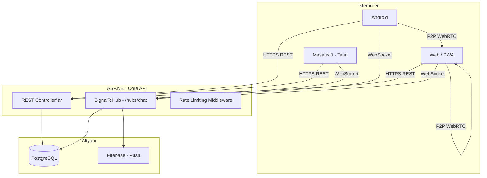

# Chatter

<div align="center">

**Kurumsal düzeyde gerçek zamanlı mesajlaşma ve görüntülü arama platformu**

[](https://reactjs.org/)
[](https://dotnet.microsoft.com/)
[](https://dotnet.microsoft.com/apps/aspnet/signalr)
[](https://webrtc.org/)
[](https://capacitorjs.com/)
[](https://tauri.app/)

[Özellikler](#temel-özellikler) • [Teknolojiler](#teknoloji-yığını) • [Başlangıç](#başlangıç) • [Mimari](#mimari) • [Dağıtım](#dağıtım) • [Lisans](#lisans)

</div>

---

## Genel Bakış

Chatter; web, Android ve masaüstü platformlarını tek bir kod tabanından destekleyen, **üretime hazır gerçek zamanlı iletişim platformudur**. Performans, ölçeklenebilirlik ve kullanıcı deneyimi önceliğiyle geliştirilmiştir:

- **Gerçek zamanlı mesajlaşma** — SignalR WebSocket ile düşük gecikmeli iletişim
- **Eşler arası görüntülü/sesli aramalar** — WebRTC ile (medya sunucusu gerekmez)
- **Çok platform desteği** — Web, Android (Capacitor) ve masaüstü (Tauri) için native uygulamalar
- **Kurumsal güvenlik** — JWT kimlik doğrulama, yenileme token rotasyonu ve hız sınırlama
- **Modern arayüz** — Karanlık/Aydınlık tema, PWA desteği ve akıcı animasyonlar

---

## Temel Özellikler

### Gerçek Zamanlı İletişim
- **Anlık Mesajlaşma** — SignalR WebSocket tabanlı, otomatik yeniden bağlanma
- **Yazıyor Göstergesi** — Karşı taraf yazarken canlı bildirim
- **Okundu Bilgisi** — İletilen ve okunan mesajlar için çift onay işareti
- **Çevrimiçi Durum** — Gerçek zamanlı kullanıcı varlık takibi
- **Mesaj Tepkileri** — Emoji ile anlık geri bildirim
- **Yanıtla ve Alıntıla** — Bağlam farkındalığıyla mesaj zincirleme

### WebRTC Sesli ve Görüntülü Arama
- **P2P Mimari** — Doğrudan eşler arası bağlantı (sıfır medya sunucusu maliyeti)
- **HD Video Kalitesi** — Uyarlanabilir bit hızıyla optimum kalite
- **Arama Yönetimi** — Gelen arama bildirimleri, kabul/reddetme arayüzü
- **Ağ Dayanıklılığı** — Bağlantı koptuğunda otomatik yeniden bağlanma
- **Ses Kontrolleri** — Mikrofon/kamera kapatma

### Çok Platform Desteği

| Platform | Teknoloji | Çıktı |
|----------|-----------|-------|
| Web | Vite + React | PWA destekli SPA |
| Android | Capacitor 8 | İmzalı `.apk` |
| Linux Masaüstü | Tauri 2 | `.AppImage` / `.deb` |
| Windows Masaüstü | Tauri 2 | `.exe` yükleyici |

- **Push Bildirimleri** — Firebase Cloud Messaging ile arka planda bildirim (mobil)
- **Native Bildirimler** — Tauri ile masaüstü sistem bildirimleri
- **Otomatik Güncelleme** — Tauri Updater ile OTA uygulama güncellemeleri
- **PWA** — Tarayıcıdan ana ekrana ekleme, çevrimdışı önbellekleme

### Modern Arayüz
- **Duyarlı Tasarım** — Mobil, tablet ve masaüstü için optimize
- **Karanlık/Aydınlık Temalar** — Sistem tercihi algılama ile manuel geçiş
- **Akıcı Animasyonlar** — GPU hızlandırmalı geçişler
- **Ses Efektleri** — Özelleştirilebilir sesli geri bildirim

### Güvenlik ve Gizlilik
- **JWT Kimlik Doğrulama** — Kısa ömürlü erişim + yenileme token rotasyonu
- **Rate Limiting** — Dakikada 100 istek limiti (AspNetCoreRateLimit)
- **XSS Koruması** — Sunucu tarafı girdi temizleme + DOMPurify (istemci tarafı)
- **CORS Koruması** — Yapılandırılmış kaynak doğrulama
- **Güvenlik Başlıkları** — `X-Content-Type-Options`, `X-XSS-Protection`, `Referrer-Policy`
- **Yalnızca HTTPS** — Şifreli veri iletimi

---

## Teknoloji Yığını

### Frontend
| Teknoloji | Versiyon | Amaç |
|-----------|---------|------|
| [React](https://reactjs.org/) | 18.2 | Kullanıcı Arayüzü |
| [Vite](https://vitejs.dev/) | 5.0 | Build Aracı & Geliştirme Sunucusu |
| [React Router](https://reactrouter.com/) | 7.x | İstemci Tarafı Yönlendirme |
| [Tailwind CSS](https://tailwindcss.com/) | 3.4 | Utility-first CSS |
| [Lucide React](https://lucide.dev/) | — | İkon Kütüphanesi |
| [DOMPurify](https://github.com/cure53/DOMPurify) | 3.x | XSS Koruması |

### Backend
| Teknoloji | Versiyon | Amaç |
|-----------|---------|------|
| [ASP.NET Core](https://dotnet.microsoft.com/) | 9.0 | Web API & SignalR |
| [Entity Framework Core](https://docs.microsoft.com/ef/core/) | 9.0 | ORM & Migrations |
| [ASP.NET Identity](https://docs.microsoft.com/aspnet/core/security/authentication/identity) | 9.0 | Kullanıcı Yönetimi |
| [MediatR](https://github.com/jbogard/MediatR) | 14.x | CQRS / Mediator |
| [FluentValidation](https://fluentvalidation.net/) | 12.x | Girdi Doğrulama |
| [PostgreSQL](https://www.postgresql.org/) | 15 | Veritabanı |
| [Firebase Admin](https://firebase.google.com/docs/admin/setup) | 3.x | Push Bildirimleri |
| [AspNetCoreRateLimit](https://github.com/stefanprodan/AspNetCoreRateLimit) | 5.x | Rate Limiting |

### Gerçek Zamanlı & Medya
| Teknoloji | Amaç |
|-----------|------|
| [SignalR](https://dotnet.microsoft.com/apps/aspnet/signalr) | WebSocket tabanlı mesajlaşma & sinyal |
| [WebRTC](https://webrtc.org/) | Eşler arası video/ses akışı |
| [Simple-Peer](https://github.com/feross/simple-peer) | WebRTC için sade peer bağlantı kütüphanesi |

### Mobil & Masaüstü
| Teknoloji | Platform | Amaç |
|-----------|----------|------|
| [Capacitor 8](https://capacitorjs.com/) | Android / iOS | Web → Native köprü |
| [Tauri 2](https://tauri.app/) | Windows / Linux | Hafif, Rust tabanlı masaüstü framework'ü |
| [Firebase Cloud Messaging](https://firebase.google.com/docs/cloud-messaging) | Android | Arka plan push bildirimleri |

### DevOps & Dağıtım
| Araç | Amaç |
|------|------|
| [Docker](https://www.docker.com/) | Container tabanlı deployment |
| [GitHub Actions](https://docs.github.com/actions) | CI/CD & otomatik release |
| [Render.com](https://render.com/) | Backend hosting |
| [Vercel](https://vercel.com/) | Frontend hosting |

---

## Başlangıç

### Ön Gereksinimler

| Araç | Versiyon | Notlar |
|------|---------|--------|
| [Node.js](https://nodejs.org/) | 20+ | Frontend için |
| [.NET SDK](https://dotnet.microsoft.com/download) | 9.0+ | Backend için |
| [PostgreSQL](https://www.postgresql.org/) | 15+ | Veritabanı (veya Docker) |
| [Android Studio](https://developer.android.com/studio) | Güncel | Yalnızca mobil build |
| [Rust](https://www.rust-lang.org/) | Kararlı | Yalnızca masaüstü build |

### Hızlı Başlangıç (Docker ile)

Yalnızca Docker ile tüm stack'i ayağa kaldırabilirsiniz:

```bash
git clone https://github.com/kullaniciadi/chatter.git
cd chatter

# PostgreSQL + API'yi başlat (80. porttan erişilebilir)
docker-compose up -d
```

Sonrasında `src/Chatter.UI` dizininde frontend'i çalıştırın:

```bash
cd src/Chatter.UI
npm install
npm run dev
# → http://localhost:5173 adresinde açılır
```

---

### Manuel Kurulum (Geliştirme)

**1. Depoyu Klonlayın**
```bash
git clone https://github.com/kullaniciadi/chatter.git
cd chatter
```

**2. Backend Kurulumu**
```bash
cd src/Chatter.API

# Bağımlılıkları yükle
dotnet restore

# Ortam değişkenlerini yapılandır
# appsettings.json içinde PostgreSQL bağlantı dizesini düzenleyin
# veya aşağıdaki env değişkenlerini ayarlayın:
#   DB_HOST, DB_NAME, DB_USER, DB_PASSWORD

# Veritabanı tablolarını oluştur (migration'ları çalıştır)
dotnet ef database update

# API'yi başlat (http://localhost:5000)
dotnet run
```

**3. Frontend Kurulumu**
```bash
cd src/Chatter.UI

# Bağımlılıkları yükle
npm install

# Ortam değişkenlerini yapılandır
cp .env.example .env
# .env dosyasını açıp VITE_BACKEND_URL'i ayarlayın

# Geliştirme sunucusunu başlat (http://localhost:5173)
npm run dev
```

---

### Platform Build'leri

#### Web (Üretim)
```bash
cd src/Chatter.UI
npm run build
# Çıktı: dist/ klasörü — Vercel veya herhangi bir statik hostinge deploy edilebilir
```

#### Android APK
```bash
cd src/Chatter.UI

# Web varlıklarını build et ve Android projesine aktar
npm run android:sync

# Android Studio'da açarak build al
npm run android:open
# Android Studio → Build → Build Bundle(s) / APK(s) → Build APK(s)

# VEYA komut satırından direkt release APK oluştur
npm run android:build
```

#### Masaüstü (Windows / Linux) — Tauri
```bash
cd src/Chatter.UI

# Geliştirme modunda çalıştır
npm run tauri:dev

# Üretim için paketlenmiş uygulama oluştur
npm run tauri:build
# Linux çıktısı: src-tauri/target/release/bundle/ (.AppImage, .deb)
# Windows çıktısı: src-tauri/target/release/bundle/ (.exe yükleyici)
```

#### iOS (macOS gerektirir)
```bash
cd src/Chatter.UI
npm run build
npx cap sync ios
npx cap open ios
# Xcode'da imzalama yapılandırmasını tamamlayın ve build alın
```

---

## Mimari

Chatter, **Clean Architecture** prensibiyle dört katmanlı bir .NET çözümü üzerine inşa edilmiştir.

### Katmanlı Mimari

```
Chatter.Domain          ← Çekirdek varlıklar, enum'lar, repository arayüzleri
    ↑
Chatter.Application     ← Servisler, DTO'lar, doğrulama, Result<T> sarmalayıcı
    ↑
Chatter.Infrastructure  ← EF Core DbContext, repository uygulamaları, migration'lar, Firebase
    ↑
Chatter.API             ← Controller'lar, SignalR Hub, middleware, DI yapılandırması
```

Her katman yalnızca bir alt katmanı tanır; bu sayede iş mantığı altyapıdan tamamen bağımsızdır.

### Sistem Mimarisi


```mermaid
graph TB
    subgraph İstemciler
        W[Web / PWA]
        A[Android]
        D[Masaüstü - Tauri]
    end

    subgraph ASP.NET Core API
        C[REST Controller'lar]
        H[SignalR Hub - /hubs/chat]
        RL[Rate Limiting Middleware]
    end

    subgraph Altyapı
        DB[(PostgreSQL)]
        FCM[Firebase - Push]
    end

    W & A & D -->|HTTPS REST| C
    W & A & D -->|WebSocket| H
    W & A -->|P2P WebRTC| W
    C & H --> DB
    H --> FCM
```

### Önemli Dosyalar

| Dosya | Açıklama |
|-------|----------|
| `src/Chatter.API/Hubs/ChatHub.cs` | SignalR hub — mesajlaşma, yazıyor göstergesi, varlık ve WebRTC sinyali |
| `src/Chatter.UI/src/App.jsx` | Ana React bileşeni — auth durumu, SignalR bağlantısı, yönlendirme |
| `src/Chatter.UI/src/hooks/useWebRTC.js` | WebRTC eşler arası bağlantı mantığı |
| `src/Chatter.Infrastructure/Data/ChatterDbContext.cs` | EF Core DbContext ve entity yapılandırmaları |

### Uygulama Akışları

#### Kimlik Doğrulama
```
1. Kullanıcı giriş yapar → API JWT erişim token'ı + yenileme token'ı döner
2. Frontend token'ları saklar
3. SignalR bağlantısı JWT ile kurulur
4. Kullanıcı "çevrimiçi" olarak işaretlenir (varlık takibi)
5. Erişim token'ı süresi dolunca yenileme token'ı ile sessizce yenilenir
```

#### Gerçek Zamanlı Mesajlaşma
```
1. Kullanıcı mesaj yazar → SignalR Hub'a gönderilir
2. Hub mesajı veritabanına kaydeder
3. Hub alıcıya anlık iletir
4. Alıcı mesajı görüntülediğinde "okundu" sinyali gönderilir
```

#### WebRTC Video/Ses Arama
```
1. Arayan → SignalR üzerinden "offer" sinyali gönderir
2. Aranan → "answer" ile yanıt verir
3. Her iki taraf ICE adaylarını değiştirir
4. P2P bağlantısı kurulur
5. Medya akışları (video/ses) doğrudan karşıya iletilir
```

### Proje Klasör Yapısı

```
Chatter/
├── Chatter/                          # .NET çözüm dosyası
│   └── Chatter.sln
│
├── src/
│   ├── Chatter.Domain/               # Varlıklar & arayüzler
│   │   └── Entities/                 # AppUser, Conversation, Message, Call, ...
│   │
│   ├── Chatter.Application/          # İş mantığı katmanı
│   │   ├── Services/                 # AuthService, ChatService, CallService, UserService
│   │   ├── DTOs/                     # Veri transfer nesneleri
│   │   └── Common/                   # Result<T>, hata tipleri
│   │
│   ├── Chatter.Infrastructure/       # Veri erişim katmanı
│   │   ├── Data/                     # ChatterDbContext, entity yapılandırmaları
│   │   ├── Repositories/             # Generic + özel repository'ler
│   │   ├── Migrations/               # EF Core migration'ları
│   │   └── Services/                 # Firebase push notification servisi
│   │
│   ├── Chatter.API/                  # Sunum katmanı
│   │   ├── Controllers/              # Auth, Chat, Call, Files, User
│   │   ├── Hubs/                     # ChatHub.cs (SignalR)
│   │   ├── Middleware/               # Exception handling, rate limit, loglama
│   │   └── Program.cs                # DI, middleware pipeline, otomatik migration
│   │
│   └── Chatter.UI/                   # React Frontend
│       ├── src/
│       │   ├── components/
│       │   │   ├── Auth/             # Giriş, Kayıt
│       │   │   ├── Chat/             # ChatWindow, MessageItem, Sidebar
│       │   │   ├── Call/             # IncomingCallModal, ActiveCallScreen
│       │   │   ├── Profile/          # Kullanıcı profil bileşenleri
│       │   │   └── Common/           # Paylaşılan UI bileşenleri
│       │   ├── context/              # AuthContext, ChatContext, ConnectionContext
│       │   ├── hooks/                # useWebRTC.js
│       │   ├── utils/                # soundManager, androidUpdater, ...
│       │   ├── config/               # constants.js (API_URL, HUB_URL)
│       │   └── App.jsx               # Ana uygulama bileşeni
│       ├── src-tauri/                # Tauri masaüstü yapılandırması
│       ├── android/                  # Capacitor Android projesi
│       └── public/                   # Statik varlıklar
│
├── .github/workflows/
│   └── release.yml                   # Otomatik çok platform release pipeline
└── docker-compose.yml                # PostgreSQL + API (geliştirme ortamı)
```

---

## Yapılandırma

### Frontend Ortam Değişkenleri (`.env`)

`src/Chatter.UI/.env.example` dosyasını kopyalayarak başlayın:

```bash
cp src/Chatter.UI/.env.example src/Chatter.UI/.env
```

```env
# Backend API adresi (hem REST hem de SignalR için kullanılır)
VITE_BACKEND_URL=http://localhost:5000
```

> SignalR hub adresi `VITE_BACKEND_URL/hubs/chat` olarak otomatik hesaplanır.

### Backend Yapılandırması (`appsettings.json`)

```json
{
  "ConnectionStrings": {
    "DefaultConnection": "Host=localhost;Database=chatterdb;Username=...;Password=..."
  },
  "JwtSettings": {
    "SecretKey": "buraya-guclu-bir-anahtar-girin",
    "Issuer": "ChatterAPI",
    "Audience": "ChatterClient",
    "ExpiryInMinutes": 60
  },
  "Cors": {
    "AllowedOrigins": ["http://localhost:5173", "https://chatter.example.com"]
  }
}
```

> Üretimde `SecretKey` değerini mutlaka güçlü, rastgele bir değerle değiştirin ve ortam değişkeni olarak enjekte edin.

**Docker ortamında** veritabanı ayarları şu ortam değişkenleri ile geçersiz kılınabilir:
- `DB_HOST`, `DB_NAME`, `DB_USER`, `DB_PASSWORD`

---

## Dağıtım

### Docker ile (Hızlı)

```bash
# PostgreSQL + API'yi başlat
docker-compose up -d

# API erişilebilir: http://localhost:80
# Veritabanı migration'ları API başlangıcında otomatik çalışır
```

### Otomatik Release Pipeline (CI/CD)

Tüm platform build'leri GitHub Actions tarafından yönetilir. Tek bir komutla yeni sürüm yayınlayabilirsiniz:

```bash
bash scripts/release-tool.sh 1.7.0 "Sürüm notlarınız buraya"
```

Bu komut:
1. `release.yml` workflow'unu GitHub Actions üzerinde tetikler
2. Build durumunu terminalden canlı takip eder
3. İş tamamlandığında GitHub Releases sayfasına yönlendirir

**Pipeline'ın ürettiği artifactlar:**

| Dosya | Platform |
|-------|----------|
| `Chatter_API_{version}_linux-x64.tar.gz` | Backend sunucu paketi |
| `Chatter_{version}_Web.tar.gz` | Statik web build |
| `Chatter_{version}_amd64.AppImage` | Linux masaüstü |
| `Chatter_{version}_amd64.deb` | Linux masaüstü (Debian) |
| `Chatter_{version}_Android.apk` | Android (imzalı) |
| `Chatter_{version}_x64-setup.exe` | Windows yükleyici |
| `SHA256SUMS.txt` | Tüm dosyalar için checksum |

> GitHub → Actions → **Release Pipeline** ekranından `workflow_dispatch` ile de tetiklenebilir.

### Frontend (Vercel)

```bash
npm i -g vercel
cd src/Chatter.UI
vercel --prod
```

`vercel.json` zaten yapılandırılmış durumdadır: SPA yönlendirmeleri ve güvenlik başlıkları otomatik uygulanır.

### Backend (Render.com / Docker)

```bash
# Render.com üzerinde Docker deploy için hazır
# docker-compose.yml içindeki Dockerfile çok aşamalı build kullanır
docker build -t chatter-api src/Chatter.API/
```

---

## Katkıda Bulunma

Katkılar memnuniyetle karşılanır! Lütfen şu adımları izleyin:

1. Depoyu fork edin
2. Özellik dalı oluşturun (`git checkout -b feature/HarikaOzellik`)
3. Değişikliklerinizi commit edin (`git commit -m 'feat: harika özellik eklendi'`)
4. Dalınıza push edin (`git push origin feature/HarikaOzellik`)
5. Pull Request açın

### Geliştirme Kuralları
- Mevcut kod stilini ve Clean Architecture katmanlarını takip edin
- Anlamlı commit mesajları yazın (tercihan [Conventional Commits](https://www.conventionalcommits.org/))
- Yeni özellikler için gerekli doğrulamaları ve testleri ekleyin
- Gerektiğinde bu dokümantasyonu güncelleyin

---

## Yol Haritası

- [x] Gerçek zamanlı mesajlaşma
- [x] WebRTC görüntülü/sesli arama
- [x] Android native uygulaması (Capacitor)
- [x] Masaüstü uygulaması — Windows & Linux (Tauri)
- [x] PWA desteği
- [x] Karanlık/Aydınlık temalar
- [x] Firebase push bildirimleri
- [x] Otomatik çok platform release pipeline
- [ ] Uçtan uca şifreleme (E2EE)
- [ ] Grup görüntülü aramalar (3+ katılımcı)
- [ ] Ekran paylaşımı
- [ ] Mesaj arama
- [ ] iOS App Store yayını
- [ ] Sesli mesajlar

---

## Lisans

Bu proje **MIT Lisansı** altında lisanslanmıştır — detaylar için [LICENSE](LICENSE) dosyasına bakın.

---

<div align="center">

**[⬆ başa dön](#chatter)**

React & .NET ile ❤️ ile yapıldı

</div>
